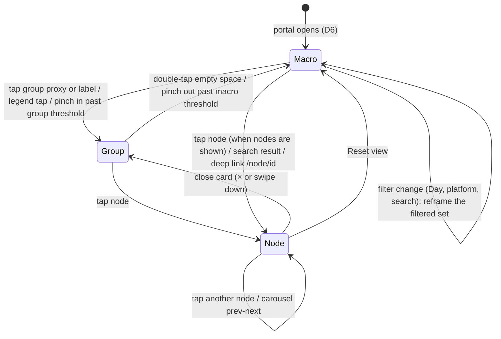

# Spatial View Architecture

Status: **approved 2026-09-27. Phases 1-7 shipped (4b: hero scaling, hub glow, group proxies and LOD; 5: the 2D board morph; 6: WebXR mixed reality; 7: Agentic Synthesis and Outcome Nodes). Next: hands-on tuning on a headset; see [PROJECT_STATE.md](PROJECT_STATE.md) for the live state, configuration and next steps.** This spec covers hierarchical clustering with semantic zoom, a camera rig that zooms from the whole graph down to one node, a hybrid AI-plus-user grouping model, and a seamless switch between the 3D spatial view and a flat 2D node editor. It builds on what the graph view already does (see [ARCHITECTURE.md](ARCHITECTURE.md)) instead of replacing it, and follows the main portal system in [DESIGN.md](DESIGN.md).

## Locked decisions

| # | Decision | Where |
| --- | --- | --- |
| D1 | **Tags come from the user and from the miner.** Manual `#hashtags` are always kept. The daily miner also extracts keywords and conceptual connections for every node, in the same batched Gemini call it already makes. | 1.2, 1.5 |
| D2 | **Hybrid grouping.** AI-suggested concept groups and user-created groups live in one list. A user's choice always wins, and the miner never overrides it. | 1.1, 1.3 |
| D3 | **Group picker on every card.** The expanded node card and every preview card (collection cards and the focused 3D card) have a group dropdown. It reassigns the node or creates a new group on the fly, and the graph re-clusters live. | 1.6 |
| D4 | **Keep 3d-force-graph.** 2D mode uses a narrow 12° FOV dolly zoom (near-orthographic), not a true orthographic camera. | 3.2 |
| D5 | **Preview cards are the production look.** Frosted glass and abstract shapes (cones, cylinders, boxes, spheres, wireframe shells) are dropped. The reference is `mockups/mockup-cards-3d.html`. | 4.3 |
| D6 | **The portal opens in the Macro view:** a wide shot of the whole cloud, framed to fit. From there, smooth zooms go into filtered views (the Day time filter, or a chosen group). | 2.1, 2.7 |
| D7 | **WebXR-ready from Phase 3.** Aether's end goal is VR. The camera lives inside a viewer dolly, and the rig outputs viewer poses rather than writing the camera, so headset tracking and the damped animations never fight. | 5 |
| D9 | **Hubs stand out.** Highly connected cards scale up (1.0× standard, up to 1.35× for the biggest hubs) and radiate a subtle glow in their category colour that grows with connectivity (DESIGN.md glow exception, approved 2026-09-27). Phase 4b. | 2.9 |
| D10 | **Aether is an Agentic Synthesis Engine, not only a visualiser.** A subconscious synthesis layer in the background miner detects high-value patterns across the user's saves and spawns **Outcome Nodes**: AI-generated, executable workflows or action plans (Input A + Input B → Outcome C). Outcomes are the ultimate hero hubs (gold glow) and the pre-packaged blueprints the user can push to Finish Line. Proposals only: nothing runs or leaves Aether without the user. | 8 |
| D8 | **180° spatial gallery** for a focused group (Phase 4): the group's cards leave the cloud and form a curved wall around the viewer. Geometry in section 6, confirmed 2026-09-27. | 6 |

## 0. Where we are today

| Capability | Today (`src/index.js`) | Gap |
| --- | --- | --- |
| Grouping | One level: `getNodeCategory()`. `clusterForce()` pulls each category to an anchor on a Fibonacci sphere (`getClusterAnchor`). | No groups or tags in the data model; no sub-clusters; every node is always drawn. |
| Mining | `mineConnections()` (daily cron) sends up to 40 new nodes plus 60 recent ones to Gemini; it returns a category per new node and up to 3 edges each (`src/miner.js`). | No keywords or concept groups; nodes analysed before this change never get them. |
| Cluster visuals | `territories`: a wireframe shell and a text sprite per category, recomputed on engine ticks. | No summary object when zoomed out; shells are dropped under D5. |
| Camera moves | `flyToCategory()` and `flyToNode()` call `Graph.cameraPosition(pos, lookAt, ms)`, a fixed-duration tween. | Not interruptible mid-flight, no velocity continuity when retargeted, fixed framing distances (`90`, `radius * 2.5 + 60`). |
| Node focus | `selectNode()` opens `#node-card`; `openClusterDrawer()` lists a category. | The card can cover the focused node (right panel on desktop, bottom sheet on phones). |
| 2D mode | "2D Canvas" toggle: `pinToPlane()` sets `fz = 0`, categories move to a 4-column grid (`getFlatAnchor`), rotation off, left-drag pans. | Still a 50° perspective camera; nodes stay in a force cloud around each grid anchor; the switch snaps. |
| Rendering | `3d-force-graph` 1.80.0 (bundles its own three.js) and `three@0.180.0` imported separately, both from unpkg. | External CDN at runtime; two three.js copies (section 4.2). |

## 1. Clustering and data grouping engine

### 1.1 Groups: one list, two sources (D2)

A **group** is a named bucket a node belongs to. Every node has at most one group. Groups come from two sources that share one table:

| Source | Created by | Can be renamed or deleted by the user | Miner may assign nodes to it |
| --- | --- | --- | --- |
| `ai` | The miner, as a concept label for related nodes ("Memory & learning", "3D printing") | Yes. Renaming turns it into a `user` group. | Yes, but only nodes with no user choice. |
| `user` | The user, from the group picker (D3) | Yes | Yes, as a suggestion for unassigned nodes only. |

**Assignment rule.** Each node stores `group_id` and `group_source`:
- `group_source = 'user'`: the user picked it. The miner never changes it.
- `group_source = 'ai'`: the miner picked it. The miner may move it in a later run, and the user can override it at any time.
- `group_id` NULL: shown in an "Unsorted" group. Its layout anchor falls back to the node's category, so an unsorted graph looks like today's.

The miner is given the user's existing group names (both sources) and told to reuse them before inventing new ones, so the list does not sprawl. A new AI group is only created when at least 2 nodes in the batch share it.

### 1.2 Tags (D1)

Tags are many per node and never drive position. They feed group suggestions, secondary links and search.

| Source | How |
| --- | --- |
| `user` | `#hashtags` parsed from `user_note` on save (share sheet, Telegram, node card edit). The share sheet chips `#task` and `#done` already produce these. |
| `miner` | 3-5 lowercase keywords per node from the miner call (section 1.5), with a weight between 0 and 1. |

User tags are never removed by the miner. Miner tags are replaced on each re-mine of that node.

### 1.3 Migration `0013_groups_tags.sql` (Phase 2)

```sql
CREATE TABLE IF NOT EXISTS node_groups (
  id TEXT PRIMARY KEY,              -- 'grp_<uuid>'
  user_id TEXT,
  name TEXT NOT NULL,               -- trimmed, max 40 chars
  source TEXT NOT NULL DEFAULT 'user', -- 'user' | 'ai'
  created_at DATETIME DEFAULT CURRENT_TIMESTAMP
);
CREATE UNIQUE INDEX IF NOT EXISTS node_groups_user_name ON node_groups (user_id, name COLLATE NOCASE);

ALTER TABLE saved_nodes ADD COLUMN group_id TEXT;
ALTER TABLE saved_nodes ADD COLUMN group_source TEXT;   -- 'user' | 'ai' | NULL

CREATE TABLE IF NOT EXISTS node_tags (
  node_id TEXT NOT NULL,
  tag TEXT NOT NULL,                -- lowercased, no leading '#', max 40 chars
  user_id TEXT,
  source TEXT NOT NULL DEFAULT 'user', -- 'user' | 'miner'
  weight REAL DEFAULT 1,
  PRIMARY KEY (node_id, tag)
);
CREATE INDEX IF NOT EXISTS node_tags_user_tag ON node_tags (user_id, tag);
```

(The table is `node_groups`, not `groups`, because `GROUPS` is an SQL keyword.)

### 1.4 API (Phase 2)

| Method + path | Body | Result |
| --- | --- | --- |
| `GET /api/graph` | | Each node gains `group_id`, `group_source` and `tags: [{ tag, source }]`; the response gains `groups: [{ id, name, source, count }]`. |
| `POST /api/groups` | `{ name }` | Creates a `user` group, or returns the existing one with the same name (case-insensitive). |
| `PATCH /api/groups/:id` | `{ name }` | Renames; an `ai` group becomes `user`. |
| `DELETE /api/groups/:id` | | Deletes; its nodes become unsorted (`group_id` and `group_source` NULL). |
| `PATCH /api/node/:id` (existing board-status route) | `{ group_id }` or `{ new_group: "Name" }` or `{ group_id: null }` | Sets `group_source = 'user'`, creating the group if named. Returns `{ id, group, group_source }`. `{ status }` still moves the board column. |

All routes are scoped by `user_id` the same way as today's node routes. Names are validated: 1-40 characters after trimming, with control characters stripped.

### 1.5 Semantic mining (D1, Phase 2)

The existing single batched Gemini call in `buildMinerPrompt()` is extended, not duplicated:

- **Prompt adds:** the user's group names (at most 60, most used first), and for each NEW item a request for `tags` (3-5 specific keywords, no generic words like "article") and `group` (an existing name, or a short new concept name).
- **Response shape:**
  ```json
  {"nodes":[{"i":0,"category":"...","tags":["spaced repetition","anki"],"group":"Memory & learning"}],
   "edges":[{"a":0,"b":5,"relation":"short phrase"}]}
  ```
- **`parseMinerResponse()` adds** validation for tags (lowercase, trimmed, 2-40 characters, deduplicated, at most 5) and group names (1-40 characters). A new group name that appears for fewer than 2 nodes is dropped.
- **Writes:** miner tags replace the node's previous miner tags (user tags untouched). The group is applied only where `group_source` is NULL or `'ai'`.
- **Synthesis pass (D10, section 8):** after the batch is written, the same cron run looks for high-value cross-group patterns and may spawn up to 2 Outcome Nodes per user per day. It is a second, separate Gemini call that only runs when candidate patterns pass the local scoring in section 8.2.
- **Backfill:** nodes analysed before this change have `ai_processed_at` set, so the cron skips them. A one-off admin endpoint, `POST /api/remine?cursor=N`, pages through them in miner-sized batches, using the same paging pattern as `/api/recluster`.

Edges keep their current rules. Tags add a second source of links: two nodes sharing a miner tag with weight at least 0.6 get a `concept` link, capped at 3 per node, drawn like `semantic` links.

### 1.6 Group picker on every card (D3, Phase 2)

One DOM component, `GroupPicker`, is used in three places:

| Place | Anchor |
| --- | --- |
| Expanded node card (`#node-card`) | In `.card-head`, next to the category tag |
| Collection preview cards (list, timeline, board, carousel `.item-card`) | In `.item-head`, next to the category chip |
| Focused 3D preview card | A DOM overlay pinned under the card's projected screen position while it is focused or hovered. The card face is a canvas texture and cannot hold a real control. |

**Look** (main portal tokens):
- **Closed:** a 32px chip with a hit area of at least 44px. It shows a group-colour dot, the group name (or "Add to group"), and a chevron. It has a hairline border, 6px corners and `--bg-raised` fill.
- **Open:** a listbox popover with an `--bg-panel` background, hairline border and 8px corners, with no shadow. It contains, in order:
  - a type-to-filter input;
  - a "Your groups" section;
  - a "Suggested" section with AI groups, marked with a small spark icon;
  - a `+ Create "typed text"` row whenever the typed name matches nothing;
  - "Remove from group".
- **States:** the current group row has a teal left hairline and teal text. The hovered or keyboard-active row gets `--accent-soft`.
- **Accessibility:** WAI-ARIA combobox pattern: arrow keys, Enter, Esc, and focus returns to the chip.

**Live re-cluster.** Choosing or creating a group:
1. Updates `node.group_id` on the client immediately (optimistic).
2. Calls `Spatial.setData()`, which rebuilds the hierarchy and moves the node's anchor to the new group's island (creating an anchor for a new group).
3. Reheats the simulation gently (`d3AlphaTarget(0.15)` for 1.2 s), so the node glides to its new cluster while everything else barely moves. In 2D mode it moves to its new grid slot through the morph channel instead.
4. Sends `PATCH /api/node/:id`. On failure the client reverts the change, the node glides back, and an alert explains the error.

### 1.7 Hierarchy levels

```
L0  Universe      all visible nodes
L1  Group         one per group (hybrid), unsorted nodes grouped by category
L2  Sub-cluster   only for groups with more than 40 nodes
L3  Node
```

L2 sub-clusters are the connected components of the group's internal links (mined `ai` edges, `semantic` links and `concept` links). If one component is still more than 60% of the group, it is split with a few rounds of label propagation over the same edges. Label propagation is O(E) per round, deterministic with a seeded tie-break, and needs no AI call.

The Filters menu keeps a "Group by" choice for exploring other views: **Groups** (default, hybrid), **Category**, **Platform** (derived from the URL like the origin bar), and **Tag** (each node placed under its heaviest tag).

### 1.8 Client module: `grouping.js` (Phase 1)

Pure functions, with no DOM and no three.js, so they are unit-testable:

```js
buildHierarchy(nodes, { key }) -> {
  groups: Map<groupId, { id, key, value, label, nodeIds, count }>,
  order: groupId[],               // largest first, ties by label
  groupOf: Map<nodeId, groupId>
}
```

- Runs only when the filters, the group key or the data change (today's `applyGraphFilters()`), never per frame. Cost is O(N + E).
- Group ids are `key + ':' + value`, so anchors and camera memory survive refiltering and reassignment.
- Phase 1 ships the `category` and `platform` keys. Phase 2 adds `group` (hybrid) and `tag`, plus sub-clusters.

### 1.9 Anchors

- **L1 anchors:** today's Fibonacci-sphere anchors (`getSpherePoint`, `getSphereRadius`, `updateClusterSpacing`), indexed by group id instead of category.
- **L2 anchors:** a small Fibonacci sphere of radius `0.45 * estimateClusterRadius(groupCount)` around the L1 anchor.
- **New groups:** a new group takes the next free sphere slot, so existing islands do not move when one is added.

## 2. Camera state machine and damped transitions

### 2.1 States



| State | Camera goal | UI |
| --- | --- | --- |
| **Macro** (startup) | Frame all visible groups with a wide margin. Slow auto-rotate when idle (existing behaviour). | Group proxies (from Phase 4; until then the full node cloud); legend. |
| **Group** | Frame one group's bounding sphere. | The group's nodes as cards; cluster drawer; other groups dimmed to 35%. |
| **Node** | Close framing on one node, offset so the card does not cover it. | `#node-card` open with the group picker; node teal; its links teal; everything else dimmed. |

Orbit, pan and zoom by the user do not change the state, except that pinch or scroll across a threshold moves between Macro and Group (section 2.4). Every transition is interruptible: a new goal replaces the old one and motion continues from the current position and velocity.

### 2.2 The rig: critically damped springs

The camera uses a **critically damped spring** (the `SmoothDamp` form). Unlike plain exponential smoothing, it keeps velocity continuous when the goal changes mid-flight:

```js
// smoothTime ≈ time to cover ~63% of the way; ω = 2 / smoothTime
function smoothDamp(cur, goal, vel, smoothTime, dt) {
  const w = 2 / smoothTime, x = w * dt;
  const e = 1 / (1 + x + 0.48 * x * x + 0.235 * x * x * x); // ≈ exp(-x), stable for large dt
  const change = cur - goal;
  const temp = (vel + w * change) * dt;
  const newVel = (vel - w * temp) * e;
  return { value: goal + (change + temp) * e, vel: newVel };
}
```

Rig state, all damped per frame with `dt = min(clock delta, 1/20 s)`:

| Channel | Representation | smoothTime |
| --- | --- | --- |
| Look-at target | `Vector3` (3 scalar springs) | 0.35 s |
| Orbit | spherical `theta`, `phi` (shortest-arc wrap on `theta`) | 0.30 s |
| Distance | `log(radius)`, so zooming feels even at every scale | 0.40 s |
| FOV (2D morph only) | degrees | 0.45 s |

Highlight, dimming and scale on nodes keep exponential smoothing (λ = 7 for highlight and 4 for dimming), because those goals do not jitter.

### 2.3 Framing maths

For a bounding sphere of radius `r` and a perspective camera with vertical FOV `θv` and aspect `a`:

```
θh = 2 · atan(tan(θv / 2) · a)
d  = r · margin / sin(min(θv, θh) / 2)      margin = 1.15 (Macro), 1.25 (Group)
```

- **Group and Macro:** `r` is the max distance from the centroid to the nodes plus the card size. `updateTerritories()` already computes this.
- **Node:** `d = clamp(cardWorldHeight · 2.2, dMin, dMax)`, so the focused card fills about 45% of the view height on phones and 35% on desktop.

**Card-aware offset.** The node card covers part of the viewport: a 440-480px right panel on desktop (`#node-card`, `min-width: 768px`), or up to 78vh of bottom sheet on phones. The look-at target is shifted so the node lands in the centre of the uncovered area:

```
visibleW = 2 · d · tan(θh / 2);  visibleH = 2 · d · tan(θv / 2)
desktop: target = node + cameraRight · (cardPx / viewportW) · visibleW / 2
phone:   target = node − cameraUp    · (sheetPx / viewportH) · visibleH / 2
```

### 2.4 Semantic zoom (level of detail)

Each group gets a blend factor from how large it appears on screen, not from a fixed distance:

```
ratio = distance(camera, groupCentroid) / groupRadius
s     = smoothstep(3.5, 6.5, ratio)     // 0 → show cards, 1 → show proxy
```

- **Cards and proxy:** card opacity is `1 − s` and proxy opacity is `s`. When `s > 0.98`, the card meshes are hidden (`visible = false`), so they cost nothing.
- **Picking:** raycasting targets proxies when `s ≥ 0.5` and cards when `s < 0.5`.
- **Automatic state change:** Macro → Group happens when one group's `s` drops below 0.3 and it is nearest the view centre; Group → Macro when `s` rises above 0.7. The gap between 0.3 and 0.7 stops it flickering between states.

### 2.5 Group proxies (Macro view, Phase 4)

A proxy is a small stack of three offset preview cards, using the face of the group's most recent node. It carries a count badge and the group label, with a spark icon for AI groups. It replaces today's territory shell and sprite (D5). There are usually fewer than 40 proxies, so plain meshes are fine; they share one geometry and the card atlas.

*As built (Phase 4b):* the level of detail depends on the time scope as well as distance. **Today, This week and This month always show cards**: they are small sets meant to be read, and collapsing them would undo the startup scope. **Groups** always shows proxies. **All time** collapses by apparent size as above. The cluster being worked in (the open gallery, or the one holding the focused or hovered card) always shows its cards. Collapsed cards move to a hidden render layer, so they are neither drawn nor hit by clicks, and a tap reaches the proxy behind them, which opens that group's gallery. Proxies scale with viewing distance (2.2-6× a card) so their captions stay legible, and a cluster's floating label hides while its proxy shows.

*Deferred from Phase 4b:* `InstancedMesh` batching and the face atlas. Their purpose was to cut draw calls from hundreds of distant cards, and the LOD now stops collapsed clusters from drawing any cards at all (All time at Macro distance draws one proxy per cluster). Revisit if a real graph shows hundreds of cards at once inside a short time scope. The **3D-card group picker overlay** is also dropped: focusing any card opens the node card, which already carries the group picker.

### 2.6 Opening the full card

- A tap is handled on pointer-up, provided the pointer moved less than 8px within 450ms.
- The card opens **immediately** and the camera flies in parallel, so the UI responds at once.
- The camera's card-aware offset makes the node settle in the visible area as the card's slide-in finishes.
- Closing the card goes back to Group, with the camera easing out to the group framing.

### 2.7 Startup and filtered zooms (D6)

- **After adding a card** (Add Node, or the share sheet's View Node link): skip Macro. The portal switches to the graph if needed and opens the new card's group straight into the 180° gallery, with the new card in the centre slot of the middle row, focused and with its node card open. In 2D mode, or before the cards have loaded, it falls back to the plain Node close-up.
- **Startup scope (2026-09-27 pivot, replaces opening on everything):** the first load picks the shortest time span with at least 5 cards: Today, else This week, This month, All time. The portal opens small and fast, and the Macro framing applies to that span. A deep link keeps whatever span shows its card.
- **Semantic zoom:** a stepper at the start of the filter toolbar (− label +) steps the span Today → This week → This month → All time and back, reframing each time. Pulling the camera back past 1.8× the fitted distance of what is shown widens the span one step, so zooming out reveals more time rather than just making cards smaller. It is kept in sync with the Filters menu's time select. The steps are Today → This week → This month → **Groups** (all time, every cluster collapsed into its proxy) → All time; the Filters menu offers "All Time as Groups" too. The startup scope never picks Groups.
- **On load:** once the first layout has spread (about 2.2 s), the rig glides in to the Macro framing, then idle auto-rotate takes over. A deep link (`/node/<id>`) skips Macro and goes straight to Node. *As built (Phase 3):* there is no separate 1.6× pre-position, because jumping there before the layout spreads showed as a visible pop; the first glide is the ease-in.
- **Time filter "Day" (or any filter that shrinks the set):** the rig reframes onto the bounding sphere of the visible nodes. If they all belong to one group, it enters Group state for that group.
- **Choosing a group** (legend, drawer, or a picker's "Show group" action): Group state for it.
- **Clearing filters:** back to Macro.

### 2.8 Coexisting with 3d-force-graph's controls

`Graph.controls()` stays as the input handler for free orbit, pan and zoom. The rig only drives the camera while a transition is active:

1. **Transition starts:** `controls.enabled = false`; the rig writes `camera.position`, `camera.lookAt` and `controls.target` each frame.
2. **Arrival** (every channel within 0.5% of its goal and speed below a threshold): copy the rig state into `controls.target`, call `controls.update()`, then `controls.enabled = true`.
3. **User input during a transition** (`pointerdown` or `wheel` on the canvas): cancel the rig immediately, keeping the current pose, and re-enable controls in the same event.
4. **Replacements:** `Graph.cameraPosition(...)` calls in `flyToCategory`, `flyToNode` and `resetCameraView` become `rig.goTo({ target, theta?, phi?, distance })`, and `scheduleFit()` becomes a Macro framing goal.
5. **Poses, not camera writes (D7):** the rig produces `{ position, target }` poses and the viewer adapter (`createViewer` in `camera-rig.js`) applies them. On screens it sets the camera and `controls.target`; the camera's parent dolly stays at the origin, so orbit controls are unaffected. See section 5.

*As built (Phase 3):* gestures are unchanged from today. A single tap on empty canvas still clears the selection without moving the camera, and a double tap frames Macro. Filter changes (time, type, search) reframe the visible set after 400 ms, entering Group state when only one cluster is left. `Graph.cameraPosition` remains only as a fallback for the moment before the spatial modules have loaded.

### 2.9 Hub weighting (D9, Phase 4b)

Highly connected cards read as more important at a glance, through size and a glow in their category colour (DESIGN.md glow exception). Teal stays reserved for focus.

**Weight.** Computed from the visible links whenever the filters or links change (`applyGraphFilters`), never per frame:

```
degree(n) = Σ over visible links touching n of:  ai (mined or manual) 1.0 · concept 0.6 · semantic 0.5
            category chain links count 0 (every node has them, so they carry no signal)
weight(n) = log(1 + degree(n)) / log(1 + max visible degree)          // 0..1, relative to what is on screen
```

The log keeps one giant hub from flattening everyone else. Because the weight is relative to the visible set, filtering to Day or to one group re-ranks the hubs within it.

**Hero scaling.** `scale = 1 + 0.35 · smoothstep(0.15, 1, weight)`: standard cards stay at 1.0×, and the top hub reaches 1.35×. It multiplies with the hover and focus scale and animates on the same damped channel, so re-ranking after a filter change eases rather than pops. The collision radius grows with the scale, so big hubs push their neighbours back rather than overlapping them.

**Hub glow.** Cards with a weight above 0.35 get a soft halo behind the card in their category colour (the legend colour; rainbow mode uses the card's hue). The halo is one additive sprite with a radial falloff, 1.4-1.9× the card's size, at opacity 0.12-0.45 rising with weight. It never uses teal, fades out with dimming, and sits behind the card so text contrast is unaffected. Outcome Nodes (section 8) use Outcome Gold at up to 0.7 opacity with a slow 4 s breathing pulse, and always take the maximum hero scale.

**Where it applies.** Macro and Group views, 2D mode, and group proxies (a proxy's aura comes from its group's summed degree). In the 180° gallery, cards keep uniform size, so the arc spacing stays exact, but keep their aura, so hubs are still visible on the wall. Dimmed cards fade their aura along with the card.

**Performance.** One shared shadow texture and plane geometry; aura planes exist only for cards above the threshold, typically under 20% of the visible nodes.

## 3. The 2D / 3D mode switcher

### 3.1 Approach: a morph, not a rebuild

Switching modes drives one damped scalar `m` (0 = spatial 3D, 1 = flat 2D), with smoothTime 0.5 s. Everything below is a pure function of `m`, so reversing the switch mid-morph just reverses smoothly.

| Channel | 3D (m = 0) | 2D (m = 1) |
| --- | --- | --- |
| Node position | Force layout `(x, y, z)` | Grid slot `(gx, gy, 0)` |
| Card rotation | Lazy face-camera plus lean | Flat, facing +Z |
| Camera orbit | Free | Locked: `phi → π/2`, `theta → 0`, no roll |
| FOV | 50° | 12° (D4) |
| Links | Straight lines | Node-editor curves between card edges |
| Simulation | Running (cooldown as today) | Stopped; nodes pinned with `fx`, `fy`, `fz` at grid slots |

Displayed position: `p = lerp(p3D, pGrid, smoothstep(m))`. The force layout's own coordinates are kept untouched while in 2D, so switching back returns every node to where it was.

### 3.2 The 12° dolly zoom (D4)

3d-force-graph creates and owns a `PerspectiveCamera`, so the 2D mode narrows the FOV and moves the camera back by the matching factor. This keeps the framed area constant:

```
d2D = d3D · tan(fov3D / 2) / tan(fov2D / 2)      // 50° → 12°: about 4.4× farther
```

At 12° the depth distortion across a flat plane is under 1%, which is visually orthographic. FOV and distance change together each frame, so the grid appears to straighten in place instead of zooming. `camera.near` and `camera.far` are rescaled with distance to keep depth precision. A true orthographic camera is out of scope.

### 3.3 Grid layout (`layout-2d.js`, pure)

A node-editor board: one **column per group**, cards stacked in rows.

```
colWidth  = cardW + 48          rowHeight = cardH + 24          groupGap = 96
column order: groups by size, largest first (stable tie-break by label); Unsorted last
row order:    board status (Inbox, Active, Reference, Done), then created_at desc
wrap:         a group taller than 12 rows continues in an adjacent sub-column
```

- Each column gets a **group header card**, with the label, count, group colour as a 3px top border, and the spark icon for AI groups. The header's name is editable, which renames the group.
- The board is centred on the origin, so the 2D framing is a simple bounding-box fit.
- Sub-clusters become bands inside a column, separated by a 24px gap and a hairline.
- **Reassigning in 2D:** dragging a card onto another column is the same action as the group picker (section 1.6).

### 3.4 Connection lines in 2D

- **Shape:** cubic Bézier from the right edge of the source card to the left edge of the target card, with control points at `±0.5 · |dx|` horizontally. This is the usual node-editor curve.
- **Rendering:** through 3d-force-graph's `linkThreeObject` / `linkPositionUpdate` hooks. The curve's points blend between the straight 3D segment and the Bézier using `m`.
- **Style:**
  - default links `rgba(255,255,255,0.08)`;
  - mined `ai` links in `MINED_LINK_COLOR`;
  - `concept` links dashed;
  - the focused node's links teal at 55% opacity;
  - directional particles fade out with `m`.

### 3.5 Interaction in 2D

| Input | Result |
| --- | --- |
| One-finger drag on empty canvas, left mouse drag | Pan |
| Pinch, wheel | Zoom (distance spring), clamped so a card is 40px-400px tall on screen |
| Tap card | Node state: card opens; camera pans (no rotation) with the card-aware offset |
| Drag card to another column | Reassign group (live re-cluster) |

### 3.6 As built (Phase 5)

- **The morph:** "2D Board" in the top bar switches modes. The card field damps one board weight (0.5 s) and blends every card from its force-layout position to its board slot (`layout-2d.js`), turning it flat to face +Z. The force layout is never moved or pinned, so "3D Space" returns every card to its island. Links hide on the board and return as the cards arrive back.
- **No 12° dolly zoom:** every card lies in the z = 0 plane facing the camera, and a plane square to the view has no perspective distortion, so the board already reads as orthographic at the normal field of view. D4's FOV change is not needed.
- **Board layout:** one column per cluster under the current Group by, largest first, rows by status (Inbox, Active, Reference, Done) then newest, wrapping past 12 rows. DOM column headers (label, count, colour bar) follow their columns every frame and fade in with the morph. The group legend is hidden, since the headers name every column.
- **Framing and navigation:** front-on, below the top chrome. A board too big to read whole (cards under 56px tall) is framed from its top-left corner at a readable size, which is the usual case on phones. Drag pans, wheel or pinch zooms (cards 20-400px tall), and a tap opens a card with the camera panning to it.
- **Regrouping (state sync):** dragging a card onto another column is the group picker's action. It joins that group (saved at once, rolled back if the save fails), the board re-slots it with a glide, and in 3D the force layout starts moving it to the new group's island straight away, so it is there on the way back. A card can leave its group only for its own type's column. Other drops are refused with a hint, and under Group by other than Group the columns are read-only.
- **Layouts (Groups, Status, Map):** a switcher at the bottom of the board picks the layout, remembered per browser. **Groups** is the column-per-group board above. **Status** always shows Inbox, Active, Reference and Done, empty ones included, and dropping a card on a column changes its status. **Map** dissolves the columns into a node-editor map (`layout-map.js`, pure). Each connected set of cards flows left to right along its links (a card sits one column right of what links to it), columns are ordered to cross fewer wires, sets stack largest first, and unlinked cards wait in a grid below. The framing keeps clear of both the top chrome and the switcher.
- **Map wires (section 3.4):** cubic Béziers from the source card's right edge to the target's left edge, with control points pulled out horizontally (`wirePoints`). They are drawn as one thin flat ribbon mesh on the board plane, behind the cards, reshaped every frame from where the cards are drawn, so they follow the morph and drags. They are coloured by link type: mined gold, synthesis Outcome Gold, concept violet, semantic blue, others pale teal. Dragging a card on the map just moves it; it keeps that spot until the map is laid out from scratch.
- **Guardrails and undo:** on touch a card lifts only after a 280 ms hold without moving more than 10px (with a short buzz where supported). Anything sooner is a pan, and a second finger cancels the hold. A mouse drags after 6px. Every regroup or status drop shows a toast with **Undo** for 6 s, which puts the card back through the same optimistic path.
- **Renaming:** tapping a group's column header turns its label into a text field. Enter or leaving the field saves through `PATCH /api/groups/<id>` (optimistic, rolled back with a message on failure), and Escape cancels.

## 4. Integration strategy

### 4.1 Code organisation: static client modules

`src/index.js` is over 6,000 lines, and its client script lives inside a template literal: no backslashes, no `${}`, and no unit tests. The Worker already serves `public/` as static assets, so the spatial code lives there as plain ES modules:

```
public/vendor/                     pinned third-party files, self-hosted (Phase 1)
  3d-force-graph-1.80.0.min.js
  three-0.180.0/three.module.js, three.core.js
public/js/spatial/
  tokens.js       design tokens read from CSS at runtime             (Phase 1)
  grouping.js     buildHierarchy (pure)                              (Phase 1; hybrid key in Phase 2)
  index.js        entry: exposes window.AetherSpatial                (Phase 1)
  group-picker.js GroupPicker DOM component                          (Phase 2)
  camera-rig.js   springs, framing maths, rig and WebXR-ready viewer (Phase 3)
  card-faces.js   canvas card drawing and texture atlas              (Phase 4)
  lod.js          semantic zoom and proxies                          (Phase 4)
  layout-gallery.js  180-degree gallery slots (pure)                 (Phase 4)
  layout-2d.js    grid slots and headers (pure)                      (Phase 5)
```

- **Page wiring:** the inline script talks to the modules through one object, `window.AetherSpatial`: `init(Graph, THREE, callbacks)`, `setData(nodes, links)`, `setMode('3d' | '2d')`, `focusNode(id)`, `focusGroup(id)`, `reset()`.
- **Callbacks** point back at existing functions (`selectNode`, `hideNodeCard`, `openClusterDrawer`, `closeClusterDrawer`), so the node card, drawer, filters, legend and deep links keep working.
- **Tests:** the pure modules are tested in `test/spatial/` by a second vitest project that runs in plain Node, next to the existing Workers project.

### 4.2 Rendering stack

- **3d-force-graph 1.80.0 stays (D4)**, with its force simulation, controls and picking. We replace node meshes (`nodeThreeObject`), link objects (`linkThreeObject`) and camera moves.
- **Self-hosted and pinned (Phase 1):** both libraries are served from `/vendor/` instead of unpkg. That removes the runtime CDN dependency and guards against a bad publish.
- **Two three.js copies remain for now.** The UMD build of 3d-force-graph bundles its own three.js, and objects built with our copy already work in its scene (today's territories). Merging them means building 3d-force-graph's ES module against our three.js, which needs a bundler step the project does not have. We revisit this in Phase 4, when custom meshes carry most of the drawing, and only if profiling shows the extra download matters. Both files are cacheable, about 1.3 MB and 2.0 MB uncompressed.

### 4.3 Visual language (D5) and design tokens

`tokens.js` reads the CSS variables, so CSS stays the single source of truth. It has a fallback for every token, so a missing variable never breaks WebGL:

```js
readTokens(name => getComputedStyle(document.documentElement).getPropertyValue(name))
  -> { bgPage: '#080c14', bgPanel: '#0b1320', accent: '#00ffcc', accentLine, accentSoft, text, textMuted, hairlineAlpha: 0.08 }
```

**Preview cards everywhere (D5).** Every node is a thin rounded card: 1.28 × 0.8 world units at the reference size, with corners that read as 8px when focused. The face is drawn on a canvas:
- **Video:** `#111a28` surface with a thumbnail band (the real `image_url` when it loads, otherwise a generated placeholder), a teal play badge, the duration and the title.
- **Web link:** `#15213a` surface with a muted blue-grey inset border, favicon, domain, headline and excerpt.
- **Note:** `#101722` surface with a note icon, ruled lines and preview text.
- **Group chip:** a small group chip on every face, in the group's colour.

The cone, cylinder, box and sphere shapes (`getNodeShape`), the territory wireframe shells, and the frosted-glass idea are all removed.

**DESIGN.md rules in 3D:**
- **Teal is used only for:** the selected card, its links, the focused group's label, the active mode button and the picker's current row. Hover is a half-strength teal.
- **No glow:** no bloom pass and no additive halos. Emphasis comes from colour, scale, a 1px teal edge and dimming everything else.
- **Reduced motion:** springs use smoothTime 0.05 s, drift and auto-rotate stop, and the 2D morph becomes a short crossfade.

### 4.4 Performance budget

Target: 60 fps on a mid-range phone with 500 visible nodes, and 120 fps on desktop where the display allows.

| Area | Rule |
| --- | --- |
| Per-frame work | Only springs, LOD factors and dirty node transforms. Grouping and grid layout run on data, filter or group changes only. |
| Card textures | Two resolutions of the same face: the 32 nearest or focused cards at 512×320 (about 0.65 MB each) and the next 192 at 256×160 (about 0.16 MB), about 52 MB at most. Only cards past both budgets use the shared plain face. Each budget has a margin (8 and 24 places) so cards at a cutoff do not flip back and forth as the camera moves (hotfix 2026-09-27: the original single 64-texture budget made cards past it swap between full and plain faces during auto-rotate). |
| Draw calls | Far cards use one `InstancedMesh` per type with per-instance colour. Only near or focused cards are individual meshes with their own texture. Target under 150 draw calls. |
| Materials | `MeshBasicMaterial` for faces and `MeshStandardMaterial` for card bodies. No `MeshPhysicalMaterial` transmission. |
| Pixel ratio | `min(devicePixelRatio, 2)`, dropping to 1.5 if a rolling 2 s average frame time exceeds 20 ms. |
| Simulation | Unchanged cooldown in 3D; fully stopped in 2D (pinned). A group change reheats gently (section 1.6) instead of fully. |
| Idle | Keep today's `pauseAnimation()` when a list view is shown. Also pause after 10 s without input, springs or drift, and resume on input. |
| Drift | A display offset in `nodePositionUpdate`, never written back into the simulation. |
| Hover picking | At most one raycast per animation frame; proxies only in Macro. |

### 4.5 Phases

Each phase ships on its own and keeps the app working.

| Phase | Scope | Done when |
| --- | --- | --- |
| **1. Foundations** (shipped) | Self-host and pin three and 3d-force-graph under `public/vendor/`; `public/js/spatial/` with `tokens.js`, `grouping.js` (`category` and `platform` keys) and `index.js`; the page loads the module and takes its link-particle accent from the tokens; a Node vitest project with tests. | The graph looks and behaves the same; no unpkg requests remain; `npm test` covers grouping and tokens. |
| **2. Groups, tags and semantic mining** (in progress) | Migration 0013; group and tag API; `#hashtag` parsing; miner prompt and parser extended; `/api/remine` backfill; `GroupPicker` on the node card and collection cards; hybrid `group` key as the default layout; live re-cluster; `concept` links. | Reassign a node from a card and watch it glide to its new island; create a group from the picker; the miner fills tags and suggested groups; user choices survive re-mining. |
| **3. Camera rig and Macro startup** (shipped) | `camera-rig.js`; viewer dolly and pose adapter (D7); Macro, Group and Node states; card-aware offset; startup ease-in to Macro; filtered zooms (Day and group). | The portal opens on the wide cloud; Day and group filters glide the camera; interrupting a flight never jumps; the card never covers the focused node; the camera is parented to the dolly. |
| **4a. Preview cards and 180° gallery** (shipped) | `card-faces.js`, `card-nodes.js` (card meshes, 64-texture budget with shared low-detail faces, damped hover/focus/dim, lazy turn to the viewer, collision spacing), `layout-gallery.js` and the gallery transition (section 6); shapes and territory shells removed. | Every node is a preview card; opening a group forms the 180° gallery and closing it returns the cards to the cloud; focused cards land clear of open panels. |
| **4b. Semantic zoom, hub weighting and batching** (shipped) | Hub weighting (section 2.9); group proxies and the LOD blend (sections 2.4-2.5); the 3D-card group picker overlay; `InstancedMesh` for distant cards; a 2048² face atlas. | Hubs are recognisable at a glance in Macro and Group views; 500 nodes at 60 fps on a mid-range phone; zooming out collapses groups into proxies. |
| **5. 2D morph** | `layout-2d.js`, 12° dolly-zoom morph, Bézier links, pinned simulation, drag-to-column reassignment. | The toggle morphs both ways in about 0.5 s with no layout pop; switching back restores 3D positions. |
| **7. Agentic synthesis** (after 4b; can be scheduled before 5 and 6) | Migration 0014 (outcomes); candidate pattern scoring; the synthesis Gemini call and validator; Outcome Node creation with synthesis links; Outcome card face and node-card plan view; Accept / Dismiss / Regenerate; Finish Line export (section 8). | The daily run turns a real cross-group pattern into a cited, step-by-step plan the user can accept, dismiss or push to Finish Line; dismissed patterns do not come back; no Outcome is created without passing validation. |
| **6. WebXR** | "Enter VR" button, XR render loop, dolly-driven poses with comfort rules, controller and hand ray picking, world scale (section 5). | On a Quest-class headset: enter VR, look around the gallery, point at a card and select it, leave VR back to the same view. |

## 5. WebXR readiness (D7)

The goal is that entering VR later changes how poses are applied and how the frame loop runs, and nothing else.

### 5.1 The viewer rig (built in Phase 3)

```
scene
 └─ aether-viewer-dolly (Group)      ← the rig moves this in XR
     └─ camera (PerspectiveCamera)   ← on screens: the rig and orbit controls move this
                                       in XR: the headset owns this (local transform = head pose)
```

- **Poses, not camera writes.** `CameraRig` only ever produces `{ position, target }` poses. The viewer adapter decides where they go:
  - **Screens** (`isPresenting() === false`): the camera takes the pose and the dolly stays at the identity transform. The camera's local transform equals its world transform, so 3d-force-graph's orbit controls, picking and `getGraphBbox` framing all work unchanged.
  - **XR** (`isPresenting() === true`, Phase 6): `applyPose` refuses camera writes; Phase 6 adds the dolly path below. This is the property that stops headset tracking and the damped animations from fighting: they write different objects.
- **One source of truth for "where the viewer is"**: the rig's pose. Gallery layout (section 6) and picking read the viewer position from it, never from `camera.position` directly, so both work unchanged when the head moves inside the dolly.

### 5.2 Applying poses in XR (Phase 6)

In XR the rig drives the dolly so that the *head* ends up at the pose. Viewer comfort rules take priority over matching the screen animations exactly:

| Rule | How |
| --- | --- |
| Never rotate the view without the user | Only yaw is applied to the dolly, and only as snap turns (30°) or instantly behind a short fade. No pitch or roll ever. |
| No smooth forced translation | Rig goals that move the viewer more than about 0.5 m become a teleport: 150 ms fade to black, jump, fade in. Small moves (under 0.5 m) may glide slowly (at most 1 m/s, no acceleration spikes). |
| Content comes to the user | In XR, focusing a group or node moves the *cards* (gallery arc, card slide-forward) instead of flying the viewer. The rig's Node and Group states map to gallery states, not viewer flights. |
| Stable floor | `local-floor` reference space; the dolly's y stays 0 so the floor is where the user's real floor is. |

The dolly pose is `dolly.position = pose.position − (head position within the dolly, horizontal part)`, with yaw from the pose's viewing direction, so the head lands where the pose says without overriding the user's own head movement.

### 5.3 Frame loop

WebXR frames must be rendered from `renderer.setAnimationLoop()` (the XR session's frame callback), while 3d-force-graph renders from its own `requestAnimationFrame` loop. Phase 6 starts with a spike to check whether it is enough to pause the library's loop (`Graph.pauseAnimation()`) and render the scene from our own `setAnimationLoop` callback, stepping the force engine and controls ourselves. If the library cannot be driven that way, Phase 6 replaces its renderer with our own (the "own renderer plus `d3-force-3d`" option in section 4.2). The Phase 3 rig already runs from its own `requestAnimationFrame` step, which moves into the XR loop unchanged. *Found in Phase 4:* the pinned 3d-force-graph build exposes `tickFrame()` and `pauseAnimation()`, so driving the library from an XR loop is likely to work without replacing it.

### 5.4 Input, scale and legibility

- **Picking:** controller rays and hand-tracking pinch rays go through the same raycast path as the mouse. Select = trigger or pinch; hover = ray over a card for 150 ms.
- **Group picker in VR:** the DOM picker cannot render in XR, so Phase 6 draws the same list as a 3D panel beside the focused card (same data and `onChoose` callbacks).
- **World scale:** graph units are arbitrary (clusters are hundreds of units apart). In XR, one scale factor on the scene content maps a focused card to about 0.6 m wide at a 2 m radius. The rig's distances are defined per mode, so screen framing is unaffected.
- **Legibility:** the focused card's face is re-rendered at 1024×640 in XR; cards in the gallery use 512×320.
- **Entering VR:** show "Enter VR" only when `navigator.xr.isSessionSupported('immersive-vr')` resolves true. The portal stays fully usable without it.

### 5.5 As built (Phase 6)

- **Entering:** "Enter MR" (or "Enter VR") appears in the top bar only when `navigator.xr.isSessionSupported` says so. Mixed reality (`immersive-ar`, the headset's passthrough) is preferred, with VR as the fallback. The session uses `local-floor` and optional `hand-tracking`; in MR nothing is drawn behind the graph. The board and any open panels close first, and leaving the session (the headset's own menu) restores the screen view, controls and background.
- **Frame loop (5.3):** the spike's answer is yes. The library's `requestAnimationFrame` loop is paused, and each XR frame (`renderer.setAnimationLoop`) steps the card field, then runs one `_animationCycle` of the library (layout tick and render) and cancels the frame it schedules. The page's own card loop stands down while presenting, since the window's animation frames stop in a session.
- **Placement (`xr-math.js`, pure, tested):** every move is made on the viewer dolly (position, yaw, scale), never the camera. `placement()` cancels the head's horizontal offset so the head lands on the standpoint and keeps its height, so the dolly's y is the real floor. The dolly's scale is the world scale (graph units per metre). Overview: the graph's radius spans 1.1 m, centred 1.9 m ahead at eye height. Gallery: the user stands at the gallery's centre with its arc 1.6 m away.
- **Comfort (5.2):** placements are teleports behind a 150 ms fade, and the very first waits, dark, until the headset has reported a pose. The thumbstick snap-turns 30° about the head. There is no smooth rotation or forced glide.
- **Content comes to the user:** selecting a card opens its 180° gallery around the viewer. In a headset the arc's minimum radius is 36 units (not 18), so a card is about 0.5 m wide and the focused card slides only 10% of the radius forward. Cards on the same wall come forward without moving the viewer. In the overview the whole graph is at arm's length, so cards are drawn larger than their graph size (about 15 cm, at most 6×); inside a gallery they are true size.
- **Input (5.4):** controller and hand rays (`renderer.xr.getController`) are one teal ray each, ending at a cursor on the card they hit. They pick through a raycast of the card roots and hover the card. Select (trigger or pinch) on a card opens it; select on nothing, squeeze or B/Y goes back to the overview.
- **Culling:** three.js builds the headset's culling frustum from both eyes without allowing for a scaled parent, so with the world scaled down whole clusters were culled while in plain view. Frustum culling is switched off while presenting (re-checked every 30 frames for new cards) and restored afterwards.
- **Tested with IWER** (Meta's Immersive Web Emulation Runtime, a simulated Quest 3 injected into a headless browser): the button, entering MR, the overview in simulated passthrough, real select and squeeze events, pick and hover, the gallery teleport, same-wall focus, back, and leaving. Not yet checked on a physical headset.
- **Not yet:** the 3D group picker panel (5.4), text entry in the headset, and the 2D board in XR.

## 6. The 180° spatial gallery (D8, Phase 4)

**Status: confirmed 2026-09-27** (half cylinder, up to 3 rows, drag-to-pan on screens, spring-in and spring-out).

When a group is focused in 3D (Group state, and Node state inside it), its cards leave the force cloud and form a curved gallery wall: a half cylinder centred on the viewer, at eye level, every card facing the viewer. Macro keeps the cloud; 2D mode keeps the grid (section 3.3). The same geometry works on screens and in VR, because it is defined around the viewer pose (section 5.1).

### 6.1 Geometry (`layout-gallery.js`, pure)

Given the viewer position `V`, the horizontal forward vector `f`, right vector `r` and world up `u` (all from the rig pose), and `n` cards of size `w × h`:

```
perRow   = min(n, maxPerRow)                      maxPerRow = 9 on screens, 11 in XR
rows     = min(ceil(n / perRow), 3)               more cards page sideways (6.3)
R        = clamp(perRow · (w + gapX) / π, R_min, R_max)
α_i      = −π/2 + (i + 0.5) · π / perRow          i = column in the row, spanning −90°..+90°
y_k      = (k − (rows − 1) / 2) · (h + gapY)       k = row, centred on eye level
P_ik     = V + R · (cos α_i · f + sin α_i · r) + y_k · u
yaw_ik   = card faces V: look-at from P_ik to (V.x, P_ik.y, V.z)
```

- The arc length per slot, `πR / perRow`, is at least `w + gapX`, so cards never overlap. `R` grows with the row count until `R_max`; past that, extra cards page.
- Order: most recent first from the left (`α = −90°`), or the board order when the gallery opens from Board view.
- In VR: `R_min` = 1.6 m and `R_max` = 3.0 m (a comfortable reading distance), and eye level comes from the head height.

### 6.2 Viewing it on screens

A screen's horizontal field of view (about 70°-100°) cannot show the full 180° at once. On screens the camera stands at `V`, pulled back by `0.35 R` along `−f` so the front third of the arc fills the view. Dragging horizontally yaws the view around `V` (orbit controls with `target = V` and polar angle locked to the horizon), which looks along the wall. In VR the user simply turns their head.

### 6.3 Transitions

- **Enter gallery (Group focus):** each card springs from its cloud position to its arc slot. It uses the same critically damped spring as the camera (smoothTime 0.45 s), staggered by 20 ms from the centre outwards. At the same time the rest of the cloud dims and recedes (it is not hidden, so context stays visible).
- **Focus a card (Node state):** the card slides toward the viewer by `0.25 R` and scales 1.15, as in the cards mockup. The node card panel (screens) or 3D panel (XR) opens beside it.
- **Leave the gallery:** cards spring back to their live force-layout positions; the simulation keeps running underneath, so there is no pop.
- **Paging:** past `3 × maxPerRow` cards, the gallery rotates by one page width, a yaw of the card ring around `V`, never a rotation of the viewer (XR comfort rule, section 5.2).
- **Reduced motion:** cards cross-fade into their slots instead of flying.

### 6.4 Universal focus (2026-09-27)

The gallery is the focus state for the whole 3D graph, not only for groups. **Selecting any card**, in any time scope (Today, This week, This month, Groups or All time), opens that card's cluster as the gallery with the card focused:
- **New gallery:** the card takes the centre slot of the middle row.
- **Gallery already open on that cluster:** the camera turns to the card and the wall does not reshuffle.

This covers canvas clicks, the node card's previous/next arrows, new cards and deep links, all through one `focusCard` path. 2D mode and the moment before the cards load keep the plain Node close-up.

Dimming in the gallery follows the arc, not graph links:
- the focused card is lit (dim 0);
- the rest of its cluster stays readable along the arc (dim 0.15 while a card is focused, 0 otherwise);
- every card off the arc recedes (dim 1).

**Click-picking rule:** three.js raycasts ignore `.visible`, and 3d-force-graph treats the nearest hit of any kind as the click target. So anything hidden or not meant to be clicked leaves the default render layer: collapsed cards, faded or hidden group proxies, and hidden cluster labels. Before this rule, an invisible proxy left over from an earlier zoom-out sat over its cluster's cards and turned clicks on them into background clicks.

### 6.5 As built (Phase 4a)

- **Card size:** 12 × 7.5 world units, 0.3 thick, corner radius 0.66. The collision force uses half the card's diagonal as the radius, so cards in a cluster never overlap.
- **Entry and exit:** the gallery opens with the cluster drawer (tapping a cluster label or a drawer entry point) and closes with it. It also closes when leaving the graph view or switching to 2D. `minRadius` is 18.
- **Links:** while the gallery is open, links touching its cards are hidden, because the cards have left their simulated positions. All links are now hairlines rather than world-sized tubes, so they never turn into bars in front of a close-up card.
- **Focus:** a focused gallery card grows 1.15× and slides up to 0.25 R toward the standpoint, less when open panels leave too little free width for it to fit. The camera turns (never moves the pivot) so the card sits in the middle of the free part of the screen.
- **Thumbnails:** loaded with CORS. Hosts without CORS headers get the generated placeholder art, so a WebGL canvas is never tainted.
- **Faces:** use the category colour (the legend's) for the badge, and teal only for focus (DESIGN.md); the group chip sits in the top-right corner.
- **Depth:** the graph camera's far plane is 125000, so the face (0.02 in front of the body) and the outline could not be separated by the depth buffer at a distance and flickered. The face and body use polygon offsets (face 1/4, body 2/8) so outline over face over body holds at any distance.
- **Dragging:** the library's node dragging is off. It grabbed any press on a card and switched the orbit controls off, which froze gallery swipes; cards are placed by the card field every frame anyway. Board view's own drag is unaffected.

### 6.6 As built (gallery polish, 2026-09-27)

- **Clear centre stage:** on wide screens the group list is a left sidebar and the node card a right sidebar. The camera frames the focused card in the free strip between them (`getCardCover` reports `{ side: 'sides', left, right }`). On phones the card sheet sits at the top and the drawer at the bottom, and the camera frames the band between them (`{ side: 'band', top, bottom }`).
- **Comfortable focus distance:** a focused card fills at most 58% of the free width and 50% of the free height (`FOCUS_FILL`). When a small group's wall is nearer than that, the camera steps further back behind the standpoint instead of sliding the card. Cards on the wall and the focused card show no hover tooltip, since they are read in place.
- **Phones (bottom sheet):** a focused card hides the group list and the filter row; the node card is the one bottom sheet, opening at a 24vh peek (tag, group, source link, title) so the 3D view keeps about 70% of the screen, and the card is framed large there (88% of the width, 62% of the free height). Swiping the handle up or tapping it expands the sheet to the full details; swiping down collapses it, then closes it. The gallery arrows are replaced by horizontal swipes on the 3D view, which snap to the next or previous card.
- **Sharp text:** the focused card alone gets a 'hero' face texture at 3× (1536 × 960), with anisotropy 8.
- **Gallery arrows:** translucent ◀ ▶ buttons sit side by side at the bottom of the free area, in the dark space below the wall, and step through the wall in display order (row by row, left to right).
- **Double tap:** the halo sprites no longer take clicks, and the second tap is recognised from the raw pointer release. So a double tap inside the gallery closes the panels, leaves the gallery and zooms out to the whole graph even while the camera is still flying out.

## 8. Agentic Synthesis Engine (D10)

Aether's core value is not the map; it is what the map lets an AI notice. The background miner acts as a subconscious "big brain". It keeps reading everything the user saves, and when saves from different areas add up to something actionable, it writes that action down as an **Outcome Node**.

> Example: saves about **AI video tools**, **SEO for YouTube** and **lead-gen landing pages** become the Outcome *"Launch an AI-video lead magnet funnel"*: a 7-step plan that cites the saves it came from.

### 8.1 Principles

- **Synthesis, not similarity.** Clustering finds what is alike; synthesis finds what *combines*. The strongest candidates join 2-4 different groups or tag families that the user has been saving into recently.
- **Proposals only.** An Outcome is a suggestion. Nothing is executed, sent or shared until the user acts: Accept, Dismiss, Regenerate or Send to Finish Line.
- **Every claim is cited.** Each step of a plan names the input saves it relies on. A plan that cannot be traced back to the user's own saves is rejected by the validator.
- **Scarce and high-value.** At most 2 new Outcomes per user per day, and none when nothing scores high enough. Dismissed patterns are remembered and not proposed again.

### 8.2 Pattern detection (local, no AI)

Runs after the daily miner has written tags, groups and edges (section 1.5), over the user's last 60 days of saves:

1. **Candidate bundles:** connected sets of 3-12 nodes (over `ai`, `concept` and `semantic` links) that span **at least 2 groups or tag families**.
2. **Score** = diversity (distinct groups spanned, capped at 4) × strength (mean link weight inside the bundle) × recency (half-life 14 days on `created_at`) × novelty (1 unless the bundle overlaps an existing or dismissed Outcome's inputs by more than 60%, then 0).
3. The top 8 bundles by score, above a minimum score, go to the synthesis call. If none qualify, there is no Gemini call.

### 8.3 The synthesis call (Gemini)

One structured call per user per run. It is given the candidate bundles (titles, snippets, tags, group names) and the Blueprint template types from `TODO.md` (Project Setup, SOP, Content Creation, Ad Creation, Website Creation). It returns at most 2 Outcomes:

```json
{"outcomes":[{
  "bundle": 3,
  "template": "content_creation",
  "title": "Launch an AI-video lead magnet funnel",
  "why": "You have been saving AI video tools, YouTube SEO and landing-page lead capture in the same fortnight.",
  "goal": "One short-form AI video series that drives sign-ups to a lead magnet.",
  "steps": [{"title": "Pick the lead magnet", "detail": "...", "inputs": [0, 4]}],
  "effort": "about 2 weekends"
}]}
```

**The validator** (pure, unit-tested, like `parseMinerResponse`) enforces:
- the `bundle` index must exist;
- the template must be one of the known types;
- title 1-120 characters, and 3-10 steps;
- every step cites at least one input index from its bundle;
- lengths are clamped.

Any failure drops that Outcome. Partial results are allowed.

### 8.4 Data model (migration 0014, Phase 7)

- **Outcome Nodes are ordinary `saved_nodes` rows** with `category = 'outcome'`. They inherit the graph, search, filters, cards, groups, gallery and Board for free. The `url` column holds a stable `aether:outcome/<id>` reference, the `description` the "why", and `content` the plan as JSON (goal, steps with cited inputs, effort, template).
- **New columns on `saved_nodes`:** `outcome_status` (`proposed` | `accepted` | `dismissed` | `sent`) and `outcome_fingerprint` (a hash of the sorted input ids, used for novelty and dismiss memory).
- **Provenance:** the new table `outcome_inputs (outcome_id, node_id, user_id)` holds the inputs. `/api/graph` draws them as **synthesis** links (gold hairlines, weight 1.0 in hub weighting).
- **User control:** Accept sets `accepted` (the miner never rewrites an accepted Outcome). Dismiss sets `dismissed`, hides it, and keeps the fingerprint so the pattern is not re-proposed. Regenerate asks for a new plan for the same bundle.

### 8.5 How Outcomes look and behave

- **Hero hub by definition:** always the maximum hero scale (1.35×), with the Outcome Gold glow and breathing pulse (DESIGN.md glow exception).
- **Placement:** an Outcome's layout anchor is the centroid of its inputs' cluster anchors, so it sits *between* the islands it bridges, with gold synthesis links reaching into each.
- **Card face:** a distinct Outcome template with a gold border, an "OUTCOME ✦" badge, the goal line, the step count and effort, and chips for the input groups.
- **Node card:** shows the plan as a numbered checklist. Each step's cited inputs are tappable, and tapping one flies to that save. Actions: Accept, Dismiss, Regenerate, Send to Finish Line.
- **Startup scope and semantic zoom:** new `proposed` Outcomes always appear, even outside the current time span, so the user never misses a fresh synthesis.

### 8.6 The bridge to Finish Line

Outcomes are the pre-packaged blueprints the user manifests in the Finish Line app. "Send to Finish Line" exports a versioned blueprint:

```json
{"schema": "aether.blueprint/1", "template": "content_creation", "title": "...", "goal": "...",
 "steps": [{"title": "...", "detail": "...", "sources": [{"title": "...", "url": "..."}]}],
 "created": "2026-09-27T00:00:00Z", "outcome_id": "node_..."}
```

The transport (API endpoint, share link or file) is decided with the Finish Line hand-off work already in `TODO.md`. Sending sets `outcome_status = 'sent'`. Aether never pushes anything on its own.

### 8.7 As built (Phase 7)

- **Where it runs:** the daily cron runs synthesis for each user right after that user's miner pass. A failure is logged and never blocks mining. Settings → **✦ Synthesize Outcomes Now** (admin token) runs the same pass on demand through `POST /api/synthesize`, which pages through users like the other admin batches.
- **Plan storage:** the plan JSON lives in its own `outcome_plan` column (not `content`), so the existing content, search and preview paths never see it. Outcome rows and their `aether:` urls are left out of mining, remining and link previews.
- **Budget:** the daily cron keeps to "at most 2 per day", counting the Outcomes created in the last 24 hours. The manual **Synthesize Outcomes Now** run skips that limit so the engine can be stress-tested; each press adds at most 2 per user. Every earlier Outcome (including dismissed ones) feeds the novelty check, so repeated presses reach for new patterns instead of repeating old ones.
- **After a manual run:** the settings panel closes and the camera flies into the 180° gallery of the newest Outcome (no summary alert). If nothing was created, the summary alert explains why.
- **Routes:** `POST /api/outcome/<id>/regenerate` re-prompts with the same input bundle (refused once accepted). `GET /api/outcome/<id>/blueprint` returns the `aether.blueprint/1` JSON. `PATCH /api/node/<id>` with `outcome_status` handles Accept, Dismiss and Sent.
- **Gallery:** focusing an Outcome opens its own gallery (key `outcome:<id>`): the Outcome plus the saves it cites. Tapping a citation chip flies to that save without leaving the gallery.
- **Export transport:** for now, "Export blueprint" downloads `aether-blueprint-<id>.json` and also copies it to the clipboard when the browser allows. The status then changes to `sent`. A direct Finish Line endpoint can replace this later without changing the schema.

## 9. Still open

- **Connection Depth Slider (defined 2026-09-28, not designed or built):** a core backend parameter for the AI and clustering engine, not a visual highlight. It sets the semantic reach on a spectrum of **Obvious** (surface-level and keyword connections), **Logical** (standard semantic similarity) and **Abstract** (distant, cross-disciplinary conceptual leaps). It dictates how the engine draws node wires, forms groups (section 1) and generates Outcome blueprints (section 8). Integration points and open questions are in [PROJECT_STATE.md](PROJECT_STATE.md), next step 2.
- **Group colours:** groups hash into the existing category palette. If users want to pick colours, add `color` to `node_groups` in Phase 2.
- **Group limit:** when the miner proposes more than about 30 AI groups for a user, merge the smallest ones into their nearest neighbour by shared tags, or leave them? Decide after seeing real Phase 2 output.
