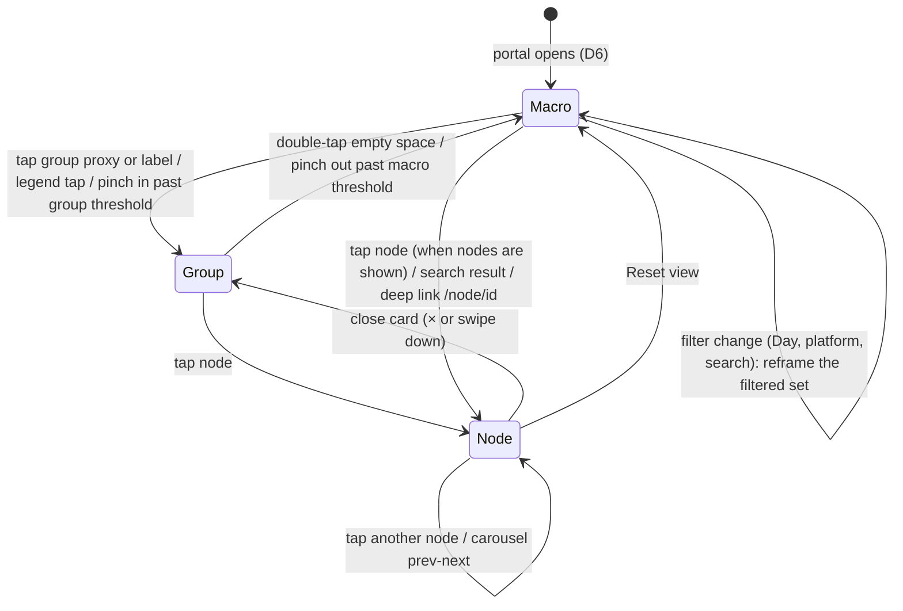

# Spatial View Architecture

Status: **approved 2026-09-27. Phases 1-3 shipped. Phase 4 in progress.** This spec covers hierarchical clustering with semantic zoom, a camera rig that zooms from the whole graph down to one node, a hybrid AI-plus-user grouping model, and a seamless switch between the 3D spatial view and a flat 2D node editor. It builds on what the graph view already does (see [ARCHITECTURE.md](ARCHITECTURE.md)) instead of replacing it, and follows the main portal system in [DESIGN.md](DESIGN.md).

## Locked decisions

| # | Decision | Where |
| --- | --- | --- |
| D1 | **Tags come from the user and from the miner.** Manual `#hashtags` are always kept. The daily miner also extracts keywords and conceptual connections for every node, in the same batched Gemini call it already makes. | 1.2, 1.5 |
| D2 | **Hybrid grouping.** AI-suggested concept groups and user-created groups live in one list. A user's choice always wins, and the miner never overrides it. | 1.1, 1.3 |
| D3 | **Group picker on every card.** The expanded node card and every preview card (collection cards and the focused 3D card) have a group dropdown. It reassigns the node or creates a new group on the fly, and the graph re-clusters live. | 1.6 |
| D4 | **Keep 3d-force-graph.** 2D mode uses a narrow 12° FOV dolly zoom (near-orthographic), not a true orthographic camera. | 3.2 |
| D5 | **Preview cards are the production look.** Frosted glass and abstract shapes (cones, cylinders, boxes, spheres, wireframe shells) are dropped. The reference is `mockups/mockup-cards-3d.html`. | 4.3 |
| D6 | **The portal opens in the Macro view:** a wide shot of the whole cloud, framed to fit. From there, smooth zooms go into filtered views (the Day time filter, or a chosen group). | 2.1, 2.7 |
| D7 | **WebXR-ready from Phase 3.** Aether's end goal is VR. The camera lives inside a viewer dolly, and the rig outputs viewer poses rather than writing the camera, so headset tracking and the damped animations never fight. | 5 |
| D8 | **180° spatial gallery** for a focused group (Phase 4): the group's cards leave the cloud and form a curved wall around the viewer. Geometry in section 6, confirmed 2026-09-27. | 6 |

## 0. Where we are today

| Capability | Today (`src/index.js`) | Gap |
| --- | --- | --- |
| Grouping | One level: `getNodeCategory()`. `clusterForce()` pulls each category to an anchor on a Fibonacci sphere (`getClusterAnchor`). | No groups or tags in the data model; no sub-clusters; every node is always drawn. |
| Mining | `mineConnections()` (daily cron) sends up to 40 new nodes plus 60 recent ones to Gemini; it returns a category per new node and up to 3 edges each (`src/miner.js`). | No keywords or concept groups; nodes analysed before this change never get them. |
| Cluster visuals | `territories`: a wireframe shell and a text sprite per category, recomputed on engine ticks. | No summary object when zoomed out; shells are dropped under D5. |
| Camera moves | `flyToCategory()` and `flyToNode()` call `Graph.cameraPosition(pos, lookAt, ms)`, a fixed-duration tween. | Not interruptible mid-flight, no velocity continuity when retargeted, fixed framing distances (`90`, `radius * 2.5 + 60`). |
| Node focus | `selectNode()` opens `#node-card`; `openClusterDrawer()` lists a category. | The card can cover the focused node (right panel on desktop, bottom sheet on phones). |
| 2D mode | "2D Canvas" toggle: `pinToPlane()` sets `fz = 0`, categories move to a 4-column grid (`getFlatAnchor`), rotation off, left-drag pans. | Still a 50° perspective camera; nodes stay in a force cloud around each grid anchor; the switch snaps. |
| Rendering | `3d-force-graph` 1.80.0 (bundles its own three.js) and `three@0.180.0` imported separately, both from unpkg. | External CDN at runtime; two three.js copies (section 4.2). |

## 1. Clustering and data grouping engine

### 1.1 Groups: one list, two sources (D2)

A **group** is a named bucket a node belongs to. Every node has at most one group. Groups come from two sources that share one table:

| Source | Created by | Can be renamed or deleted by the user | Miner may assign nodes to it |
| --- | --- | --- | --- |
| `ai` | The miner, as a concept label for related nodes ("Memory & learning", "3D printing") | Yes. Renaming turns it into a `user` group. | Yes, but only nodes with no user choice. |
| `user` | The user, from the group picker (D3) | Yes | Yes, as a suggestion for unassigned nodes only. |

**Assignment rule.** Each node stores `group_id` and `group_source`:
- `group_source = 'user'`: the user picked it. The miner never changes it.
- `group_source = 'ai'`: the miner picked it. The miner may move it in a later run, and the user can override it at any time.
- `group_id` NULL: shown in an "Unsorted" group. Its layout anchor falls back to the node's category, so an unsorted graph looks like today's.

The miner is given the user's existing group names (both sources) and told to reuse them before inventing new ones, so the list does not sprawl. A new AI group is only created when at least 2 nodes in the batch share it.

### 1.2 Tags (D1)

Tags are many per node and never drive position. They feed group suggestions, secondary links and search.

| Source | How |
| --- | --- |
| `user` | `#hashtags` parsed from `user_note` on save (share sheet, Telegram, node card edit). The share sheet chips `#task` and `#done` already produce these. |
| `miner` | 3-5 lowercase keywords per node from the miner call (section 1.5), with a weight between 0 and 1. |

User tags are never removed by the miner. Miner tags are replaced on each re-mine of that node.

### 1.3 Migration `0013_groups_tags.sql` (Phase 2)

```sql
CREATE TABLE IF NOT EXISTS node_groups (
  id TEXT PRIMARY KEY,              -- 'grp_<uuid>'
  user_id TEXT,
  name TEXT NOT NULL,               -- trimmed, max 40 chars
  source TEXT NOT NULL DEFAULT 'user', -- 'user' | 'ai'
  created_at DATETIME DEFAULT CURRENT_TIMESTAMP
);
CREATE UNIQUE INDEX IF NOT EXISTS node_groups_user_name ON node_groups (user_id, name COLLATE NOCASE);

ALTER TABLE saved_nodes ADD COLUMN group_id TEXT;
ALTER TABLE saved_nodes ADD COLUMN group_source TEXT;   -- 'user' | 'ai' | NULL

CREATE TABLE IF NOT EXISTS node_tags (
  node_id TEXT NOT NULL,
  tag TEXT NOT NULL,                -- lowercased, no leading '#', max 40 chars
  user_id TEXT,
  source TEXT NOT NULL DEFAULT 'user', -- 'user' | 'miner'
  weight REAL DEFAULT 1,
  PRIMARY KEY (node_id, tag)
);
CREATE INDEX IF NOT EXISTS node_tags_user_tag ON node_tags (user_id, tag);
```

(The table is `node_groups`, not `groups`, because `GROUPS` is an SQL keyword.)

### 1.4 API (Phase 2)

| Method + path | Body | Result |
| --- | --- | --- |
| `GET /api/graph` | | Each node gains `group_id`, `group_source` and `tags: [{ tag, source }]`; the response gains `groups: [{ id, name, source, count }]`. |
| `POST /api/groups` | `{ name }` | Creates a `user` group, or returns the existing one with the same name (case-insensitive). |
| `PATCH /api/groups/:id` | `{ name }` | Renames; an `ai` group becomes `user`. |
| `DELETE /api/groups/:id` | | Deletes; its nodes become unsorted (`group_id` and `group_source` NULL). |
| `PATCH /api/node/:id` (existing board-status route) | `{ group_id }` or `{ new_group: "Name" }` or `{ group_id: null }` | Sets `group_source = 'user'`, creating the group if named. Returns `{ id, group, group_source }`. `{ status }` still moves the board column. |

All routes are scoped by `user_id` the same way as today's node routes. Names are validated: 1-40 characters after trimming, with control characters stripped.

### 1.5 Semantic mining (D1, Phase 2)

The existing single batched Gemini call in `buildMinerPrompt()` is extended, not duplicated:

- **Prompt adds:** the user's group names (at most 60, most used first), and for each NEW item a request for `tags` (3-5 specific keywords, no generic words like "article") and `group` (an existing name, or a short new concept name).
- **Response shape:**
  ```json
  {"nodes":[{"i":0,"category":"...","tags":["spaced repetition","anki"],"group":"Memory & learning"}],
   "edges":[{"a":0,"b":5,"relation":"short phrase"}]}
  ```
- **`parseMinerResponse()` adds** validation for tags (lowercase, trimmed, 2-40 characters, deduplicated, at most 5) and group names (1-40 characters). A new group name that appears for fewer than 2 nodes is dropped.
- **Writes:** miner tags replace the node's previous miner tags (user tags untouched). The group is applied only where `group_source` is NULL or `'ai'`.
- **Backfill:** nodes analysed before this change have `ai_processed_at` set, so the cron skips them. A one-off admin endpoint, `POST /api/remine?cursor=N`, pages through them in miner-sized batches, using the same paging pattern as `/api/recluster`.

Edges keep their current rules. Tags add a second source of links: two nodes sharing a miner tag with weight at least 0.6 get a `concept` link, capped at 3 per node, drawn like `semantic` links.

### 1.6 Group picker on every card (D3, Phase 2)

One DOM component, `GroupPicker`, is used in three places:

| Place | Anchor |
| --- | --- |
| Expanded node card (`#node-card`) | In `.card-head`, next to the category tag |
| Collection preview cards (list, timeline, board, carousel `.item-card`) | In `.item-head`, next to the category chip |
| Focused 3D preview card | A DOM overlay pinned under the card's projected screen position while it is focused or hovered. The card face is a canvas texture and cannot hold a real control. |

**Look** (main portal tokens):
- **Closed:** a 32px chip with a hit area of at least 44px. It shows a group-colour dot, the group name (or "Add to group"), and a chevron. It has a hairline border, 6px corners and `--bg-raised` fill.
- **Open:** a listbox popover with an `--bg-panel` background, hairline border and 8px corners, with no shadow. It contains, in order:
  - a type-to-filter input;
  - a "Your groups" section;
  - a "Suggested" section with AI groups, marked with a small spark icon;
  - a `+ Create "typed text"` row whenever the typed name matches nothing;
  - "Remove from group".
- **States:** the current group row has a teal left hairline and teal text. The hovered or keyboard-active row gets `--accent-soft`.
- **Accessibility:** WAI-ARIA combobox pattern: arrow keys, Enter, Esc, and focus returns to the chip.

**Live re-cluster.** Choosing or creating a group:
1. Updates `node.group_id` on the client immediately (optimistic).
2. Calls `Spatial.setData()`, which rebuilds the hierarchy and moves the node's anchor to the new group's island (creating an anchor for a new group).
3. Reheats the simulation gently (`d3AlphaTarget(0.15)` for 1.2 s), so the node glides to its new cluster while everything else barely moves. In 2D mode it moves to its new grid slot through the morph channel instead.
4. Sends `PATCH /api/node/:id`. On failure the client reverts the change, the node glides back, and an alert explains the error.

### 1.7 Hierarchy levels

```
L0  Universe      all visible nodes
L1  Group         one per group (hybrid), unsorted nodes grouped by category
L2  Sub-cluster   only for groups with more than 40 nodes
L3  Node
```

L2 sub-clusters are the connected components of the group's internal links (mined `ai` edges, `semantic` links and `concept` links). If one component is still more than 60% of the group, it is split with a few rounds of label propagation over the same edges. Label propagation is O(E) per round, deterministic with a seeded tie-break, and needs no AI call.

The Filters menu keeps a "Group by" choice for exploring other views: **Groups** (default, hybrid), **Category**, **Platform** (derived from the URL like the origin bar), and **Tag** (each node placed under its heaviest tag).

### 1.8 Client module: `grouping.js` (Phase 1)

Pure functions, with no DOM and no three.js, so they are unit-testable:

```js
buildHierarchy(nodes, { key }) -> {
  groups: Map<groupId, { id, key, value, label, nodeIds, count }>,
  order: groupId[],               // largest first, ties by label
  groupOf: Map<nodeId, groupId>
}
```

- Runs only when the filters, the group key or the data change (today's `applyGraphFilters()`), never per frame. Cost is O(N + E).
- Group ids are `key + ':' + value`, so anchors and camera memory survive refiltering and reassignment.
- Phase 1 ships the `category` and `platform` keys. Phase 2 adds `group` (hybrid) and `tag`, plus sub-clusters.

### 1.9 Anchors

- **L1 anchors:** today's Fibonacci-sphere anchors (`getSpherePoint`, `getSphereRadius`, `updateClusterSpacing`), indexed by group id instead of category.
- **L2 anchors:** a small Fibonacci sphere of radius `0.45 * estimateClusterRadius(groupCount)` around the L1 anchor.
- **New groups:** a new group takes the next free sphere slot, so existing islands do not move when one is added.

## 2. Camera state machine and damped transitions

### 2.1 States



| State | Camera goal | UI |
| --- | --- | --- |
| **Macro** (startup) | Frame all visible groups with a wide margin. Slow auto-rotate when idle (existing behaviour). | Group proxies (from Phase 4; until then the full node cloud); legend. |
| **Group** | Frame one group's bounding sphere. | The group's nodes as cards; cluster drawer; other groups dimmed to 35%. |
| **Node** | Close framing on one node, offset so the card does not cover it. | `#node-card` open with the group picker; node teal; its links teal; everything else dimmed. |

Orbit, pan and zoom by the user do not change the state, except that pinch or scroll across a threshold moves between Macro and Group (section 2.4). Every transition is interruptible: a new goal replaces the old one and motion continues from the current position and velocity.

### 2.2 The rig: critically damped springs

The camera uses a **critically damped spring** (the `SmoothDamp` form). Unlike plain exponential smoothing, it keeps velocity continuous when the goal changes mid-flight:

```js
// smoothTime ≈ time to cover ~63% of the way; ω = 2 / smoothTime
function smoothDamp(cur, goal, vel, smoothTime, dt) {
  const w = 2 / smoothTime, x = w * dt;
  const e = 1 / (1 + x + 0.48 * x * x + 0.235 * x * x * x); // ≈ exp(-x), stable for large dt
  const change = cur - goal;
  const temp = (vel + w * change) * dt;
  const newVel = (vel - w * temp) * e;
  return { value: goal + (change + temp) * e, vel: newVel };
}
```

Rig state, all damped per frame with `dt = min(clock delta, 1/20 s)`:

| Channel | Representation | smoothTime |
| --- | --- | --- |
| Look-at target | `Vector3` (3 scalar springs) | 0.35 s |
| Orbit | spherical `theta`, `phi` (shortest-arc wrap on `theta`) | 0.30 s |
| Distance | `log(radius)`, so zooming feels even at every scale | 0.40 s |
| FOV (2D morph only) | degrees | 0.45 s |

Highlight, dimming and scale on nodes keep exponential smoothing (λ = 7 for highlight and 4 for dimming), because those goals do not jitter.

### 2.3 Framing maths

For a bounding sphere of radius `r` and a perspective camera with vertical FOV `θv` and aspect `a`:

```
θh = 2 · atan(tan(θv / 2) · a)
d  = r · margin / sin(min(θv, θh) / 2)      margin = 1.15 (Macro), 1.25 (Group)
```

- **Group and Macro:** `r` is the max distance from the centroid to the nodes plus the card size. `updateTerritories()` already computes this.
- **Node:** `d = clamp(cardWorldHeight · 2.2, dMin, dMax)`, so the focused card fills about 45% of the view height on phones and 35% on desktop.

**Card-aware offset.** The node card covers part of the viewport: a 440-480px right panel on desktop (`#node-card`, `min-width: 768px`), or up to 78vh of bottom sheet on phones. The look-at target is shifted so the node lands in the centre of the uncovered area:

```
visibleW = 2 · d · tan(θh / 2);  visibleH = 2 · d · tan(θv / 2)
desktop: target = node + cameraRight · (cardPx / viewportW) · visibleW / 2
phone:   target = node − cameraUp    · (sheetPx / viewportH) · visibleH / 2
```

### 2.4 Semantic zoom (level of detail)

Each group gets a blend factor from how large it appears on screen, not from a fixed distance:

```
ratio = distance(camera, groupCentroid) / groupRadius
s     = smoothstep(3.5, 6.5, ratio)     // 0 → show cards, 1 → show proxy
```

- **Cards and proxy:** card opacity is `1 − s` and proxy opacity is `s`. When `s > 0.98`, the card meshes are hidden (`visible = false`), so they cost nothing.
- **Picking:** raycasting targets proxies when `s ≥ 0.5` and cards when `s < 0.5`.
- **Automatic state change:** Macro → Group happens when one group's `s` drops below 0.3 and it is nearest the view centre; Group → Macro when `s` rises above 0.7. The gap between 0.3 and 0.7 stops it flickering between states.

### 2.5 Group proxies (Macro view, Phase 4)

A proxy is a small stack of three offset preview cards, using the face of the group's most recent node. It carries a count badge and the group label, with a spark icon for AI groups. It replaces today's territory shell and sprite (D5). There are usually fewer than 40 proxies, so plain meshes are fine; they share one geometry and the card atlas.

### 2.6 Opening the full card

- A tap is handled on pointer-up, provided the pointer moved less than 8px within 450ms.
- The card opens **immediately** and the camera flies in parallel, so the UI responds at once.
- The camera's card-aware offset makes the node settle in the visible area as the card's slide-in finishes.
- Closing the card goes back to Group, with the camera easing out to the group framing.

### 2.7 Startup and filtered zooms (D6)

- **On load:** once the first layout has spread (about 2.2 s), the rig glides in to the Macro framing, then idle auto-rotate takes over. A deep link (`/node/<id>`) skips Macro and goes straight to Node. *As built (Phase 3):* there is no separate 1.6× pre-position, because jumping there before the layout spreads showed as a visible pop; the first glide is the ease-in.
- **Time filter "Day" (or any filter that shrinks the set):** the rig reframes onto the bounding sphere of the visible nodes. If they all belong to one group, it enters Group state for that group.
- **Choosing a group** (legend, drawer, or a picker's "Show group" action): Group state for it.
- **Clearing filters:** back to Macro.

### 2.8 Coexisting with 3d-force-graph's controls

`Graph.controls()` stays as the input handler for free orbit, pan and zoom. The rig only drives the camera while a transition is active:

1. **Transition starts:** `controls.enabled = false`; the rig writes `camera.position`, `camera.lookAt` and `controls.target` each frame.
2. **Arrival** (every channel within 0.5% of its goal and speed below a threshold): copy the rig state into `controls.target`, call `controls.update()`, then `controls.enabled = true`.
3. **User input during a transition** (`pointerdown` or `wheel` on the canvas): cancel the rig immediately, keeping the current pose, and re-enable controls in the same event.
4. **Replacements:** `Graph.cameraPosition(...)` calls in `flyToCategory`, `flyToNode` and `resetCameraView` become `rig.goTo({ target, theta?, phi?, distance })`, and `scheduleFit()` becomes a Macro framing goal.
5. **Poses, not camera writes (D7):** the rig produces `{ position, target }` poses and the viewer adapter (`createViewer` in `camera-rig.js`) applies them. On screens it sets the camera and `controls.target`; the camera's parent dolly stays at the origin, so orbit controls are unaffected. See section 5.

*As built (Phase 3):* gestures are unchanged from today. A single tap on empty canvas still clears the selection without moving the camera, and a double tap frames Macro. Filter changes (time, type, search) reframe the visible set after 400 ms, entering Group state when only one cluster is left. `Graph.cameraPosition` remains only as a fallback for the moment before the spatial modules have loaded.

## 3. The 2D / 3D mode switcher

### 3.1 Approach: a morph, not a rebuild

Switching modes drives one damped scalar `m` (0 = spatial 3D, 1 = flat 2D), with smoothTime 0.5 s. Everything below is a pure function of `m`, so reversing the switch mid-morph just reverses smoothly.

| Channel | 3D (m = 0) | 2D (m = 1) |
| --- | --- | --- |
| Node position | Force layout `(x, y, z)` | Grid slot `(gx, gy, 0)` |
| Card rotation | Lazy face-camera plus lean | Flat, facing +Z |
| Camera orbit | Free | Locked: `phi → π/2`, `theta → 0`, no roll |
| FOV | 50° | 12° (D4) |
| Links | Straight lines | Node-editor curves between card edges |
| Simulation | Running (cooldown as today) | Stopped; nodes pinned with `fx`, `fy`, `fz` at grid slots |

Displayed position: `p = lerp(p3D, pGrid, smoothstep(m))`. The force layout's own coordinates are kept untouched while in 2D, so switching back returns every node to where it was.

### 3.2 The 12° dolly zoom (D4)

3d-force-graph creates and owns a `PerspectiveCamera`, so the 2D mode narrows the FOV and moves the camera back by the matching factor. This keeps the framed area constant:

```
d2D = d3D · tan(fov3D / 2) / tan(fov2D / 2)      // 50° → 12°: about 4.4× farther
```

At 12° the depth distortion across a flat plane is under 1%, which is visually orthographic. FOV and distance change together each frame, so the grid appears to straighten in place instead of zooming. `camera.near` and `camera.far` are rescaled with distance to keep depth precision. A true orthographic camera is out of scope.

### 3.3 Grid layout (`layout-2d.js`, pure)

A node-editor board: one **column per group**, cards stacked in rows.

```
colWidth  = cardW + 48          rowHeight = cardH + 24          groupGap = 96
column order: groups by size, largest first (stable tie-break by label); Unsorted last
row order:    board status (Inbox, Active, Reference, Done), then created_at desc
wrap:         a group taller than 12 rows continues in an adjacent sub-column
```

- Each column gets a **group header card**, with the label, count, group colour as a 3px top border, and the spark icon for AI groups. The header's name is editable, which renames the group.
- The board is centred on the origin, so the 2D framing is a simple bounding-box fit.
- Sub-clusters become bands inside a column, separated by a 24px gap and a hairline.
- **Reassigning in 2D:** dragging a card onto another column is the same action as the group picker (section 1.6).

### 3.4 Connection lines in 2D

- **Shape:** cubic Bézier from the right edge of the source card to the left edge of the target card, with control points at `±0.5 · |dx|` horizontally. This is the usual node-editor curve.
- **Rendering:** through 3d-force-graph's `linkThreeObject` / `linkPositionUpdate` hooks. The curve's points blend between the straight 3D segment and the Bézier using `m`.
- **Style:**
  - default links `rgba(255,255,255,0.08)`;
  - mined `ai` links in `MINED_LINK_COLOR`;
  - `concept` links dashed;
  - the focused node's links teal at 55% opacity;
  - directional particles fade out with `m`.

### 3.5 Interaction in 2D

| Input | Result |
| --- | --- |
| One-finger drag on empty canvas, left mouse drag | Pan |
| Pinch, wheel | Zoom (distance spring), clamped so a card is 40px-400px tall on screen |
| Tap card | Node state: card opens; camera pans (no rotation) with the card-aware offset |
| Drag card to another column | Reassign group (live re-cluster) |

## 4. Integration strategy

### 4.1 Code organisation: static client modules

`src/index.js` is over 6,000 lines, and its client script lives inside a template literal: no backslashes, no `${}`, and no unit tests. The Worker already serves `public/` as static assets, so the spatial code lives there as plain ES modules:

```
public/vendor/                     pinned third-party files, self-hosted (Phase 1)
  3d-force-graph-1.80.0.min.js
  three-0.180.0/three.module.js, three.core.js
public/js/spatial/
  tokens.js       design tokens read from CSS at runtime             (Phase 1)
  grouping.js     buildHierarchy (pure)                              (Phase 1; hybrid key in Phase 2)
  index.js        entry: exposes window.AetherSpatial                (Phase 1)
  group-picker.js GroupPicker DOM component                          (Phase 2)
  camera-rig.js   springs, framing maths, rig and WebXR-ready viewer (Phase 3)
  card-faces.js   canvas card drawing and texture atlas              (Phase 4)
  lod.js          semantic zoom and proxies                          (Phase 4)
  layout-gallery.js  180-degree gallery slots (pure)                 (Phase 4)
  layout-2d.js    grid slots and headers (pure)                      (Phase 5)
```

- **Page wiring:** the inline script talks to the modules through one object, `window.AetherSpatial`: `init(Graph, THREE, callbacks)`, `setData(nodes, links)`, `setMode('3d' | '2d')`, `focusNode(id)`, `focusGroup(id)`, `reset()`.
- **Callbacks** point back at existing functions (`selectNode`, `hideNodeCard`, `openClusterDrawer`, `closeClusterDrawer`), so the node card, drawer, filters, legend and deep links keep working.
- **Tests:** the pure modules are tested in `test/spatial/` by a second vitest project that runs in plain Node, next to the existing Workers project.

### 4.2 Rendering stack

- **3d-force-graph 1.80.0 stays (D4)**, with its force simulation, controls and picking. We replace node meshes (`nodeThreeObject`), link objects (`linkThreeObject`) and camera moves.
- **Self-hosted and pinned (Phase 1):** both libraries are served from `/vendor/` instead of unpkg. That removes the runtime CDN dependency and guards against a bad publish.
- **Two three.js copies remain for now.** The UMD build of 3d-force-graph bundles its own three.js, and objects built with our copy already work in its scene (today's territories). Merging them means building 3d-force-graph's ES module against our three.js, which needs a bundler step the project does not have. We revisit this in Phase 4, when custom meshes carry most of the drawing, and only if profiling shows the extra download matters. Both files are cacheable, about 1.3 MB and 2.0 MB uncompressed.

### 4.3 Visual language (D5) and design tokens

`tokens.js` reads the CSS variables, so CSS stays the single source of truth. It has a fallback for every token, so a missing variable never breaks WebGL:

```js
readTokens(name => getComputedStyle(document.documentElement).getPropertyValue(name))
  -> { bgPage: '#080c14', bgPanel: '#0b1320', accent: '#00ffcc', accentLine, accentSoft, text, textMuted, hairlineAlpha: 0.08 }
```

**Preview cards everywhere (D5).** Every node is a thin rounded card: 1.28 × 0.8 world units at the reference size, with corners that read as 8px when focused. The face is drawn on a canvas:
- **Video:** `#111a28` surface with a thumbnail band (the real `image_url` when it loads, otherwise a generated placeholder), a teal play badge, the duration and the title.
- **Web link:** `#15213a` surface with a muted blue-grey inset border, favicon, domain, headline and excerpt.
- **Note:** `#101722` surface with a note icon, ruled lines and preview text.
- **Group chip:** a small group chip on every face, in the group's colour.

The cone, cylinder, box and sphere shapes (`getNodeShape`), the territory wireframe shells, and the frosted-glass idea are all removed.

**DESIGN.md rules in 3D:**
- **Teal is used only for:** the selected card, its links, the focused group's label, the active mode button and the picker's current row. Hover is a half-strength teal.
- **No glow:** no bloom pass and no additive halos. Emphasis comes from colour, scale, a 1px teal edge and dimming everything else.
- **Reduced motion:** springs use smoothTime 0.05 s, drift and auto-rotate stop, and the 2D morph becomes a short crossfade.

### 4.4 Performance budget

Target: 60 fps on a mid-range phone with 500 visible nodes, and 120 fps on desktop where the display allows.

| Area | Rule |
| --- | --- |
| Per-frame work | Only springs, LOD factors and dirty node transforms. Grouping and grid layout run on data, filter or group changes only. |
| Card textures | 512×320 canvases (about 0.65 MB of GPU memory each). At most 64 live textures in an LRU cache, about 42 MB. Other cards use a shared low-detail face (type colour, title bar and icon) from one 2048×2048 atlas. |
| Draw calls | Far cards use one `InstancedMesh` per type with per-instance colour. Only near or focused cards are individual meshes with their own texture. Target under 150 draw calls. |
| Materials | `MeshBasicMaterial` for faces and `MeshStandardMaterial` for card bodies. No `MeshPhysicalMaterial` transmission. |
| Pixel ratio | `min(devicePixelRatio, 2)`, dropping to 1.5 if a rolling 2 s average frame time exceeds 20 ms. |
| Simulation | Unchanged cooldown in 3D; fully stopped in 2D (pinned). A group change reheats gently (section 1.6) instead of fully. |
| Idle | Keep today's `pauseAnimation()` when a list view is shown. Also pause after 10 s without input, springs or drift, and resume on input. |
| Drift | A display offset in `nodePositionUpdate`, never written back into the simulation. |
| Hover picking | At most one raycast per animation frame; proxies only in Macro. |

### 4.5 Phases

Each phase ships on its own and keeps the app working.

| Phase | Scope | Done when |
| --- | --- | --- |
| **1. Foundations** (shipped) | Self-host and pin three and 3d-force-graph under `public/vendor/`; `public/js/spatial/` with `tokens.js`, `grouping.js` (`category` and `platform` keys) and `index.js`; the page loads the module and takes its link-particle accent from the tokens; a Node vitest project with tests. | The graph looks and behaves the same; no unpkg requests remain; `npm test` covers grouping and tokens. |
| **2. Groups, tags and semantic mining** (in progress) | Migration 0013; group and tag API; `#hashtag` parsing; miner prompt and parser extended; `/api/remine` backfill; `GroupPicker` on the node card and collection cards; hybrid `group` key as the default layout; live re-cluster; `concept` links. | Reassign a node from a card and watch it glide to its new island; create a group from the picker; the miner fills tags and suggested groups; user choices survive re-mining. |
| **3. Camera rig and Macro startup** (shipped) | `camera-rig.js`; viewer dolly and pose adapter (D7); Macro, Group and Node states; card-aware offset; startup ease-in to Macro; filtered zooms (Day and group). | The portal opens on the wide cloud; Day and group filters glide the camera; interrupting a flight never jumps; the card never covers the focused node; the camera is parented to the dolly. |
| **4. Preview cards, semantic zoom and 180° gallery** | `card-faces.js`, atlas, instancing, group proxies, LOD blend, 3D picker overlay; `layout-gallery.js` and the gallery transition (section 6); remove shapes and territory shells. | 500 nodes at 60 fps on a mid-range phone; zooming out collapses groups into proxies; focusing a group forms the 180° gallery and leaving it returns the cards to the cloud. |
| **5. 2D morph** | `layout-2d.js`, 12° dolly-zoom morph, Bézier links, pinned simulation, drag-to-column reassignment. | The toggle morphs both ways in about 0.5 s with no layout pop; switching back restores 3D positions. |
| **6. WebXR** | "Enter VR" button, XR render loop, dolly-driven poses with comfort rules, controller and hand ray picking, world scale (section 5). | On a Quest-class headset: enter VR, look around the gallery, point at a card and select it, leave VR back to the same view. |

## 5. WebXR readiness (D7)

The goal is that entering VR later changes how poses are applied and how the frame loop runs, and nothing else.

### 5.1 The viewer rig (built in Phase 3)

```
scene
 └─ aether-viewer-dolly (Group)      ← the rig moves this in XR
     └─ camera (PerspectiveCamera)   ← on screens: the rig and orbit controls move this
                                       in XR: the headset owns this (local transform = head pose)
```

- **Poses, not camera writes.** `CameraRig` only ever produces `{ position, target }` poses. The viewer adapter decides where they go:
  - **Screens** (`isPresenting() === false`): the camera takes the pose and the dolly stays at the identity transform. The camera's local transform equals its world transform, so 3d-force-graph's orbit controls, picking and `getGraphBbox` framing all work unchanged.
  - **XR** (`isPresenting() === true`, Phase 6): `applyPose` refuses camera writes; Phase 6 adds the dolly path below. This is the property that stops headset tracking and the damped animations from fighting: they write different objects.
- **One source of truth for "where the viewer is"**: the rig's pose. Gallery layout (section 6) and picking read the viewer position from it, never from `camera.position` directly, so both work unchanged when the head moves inside the dolly.

### 5.2 Applying poses in XR (Phase 6)

In XR the rig drives the dolly so that the *head* ends up at the pose. Viewer comfort rules take priority over matching the screen animations exactly:

| Rule | How |
| --- | --- |
| Never rotate the view without the user | Only yaw is applied to the dolly, and only as snap turns (30°) or instantly behind a short fade. No pitch or roll ever. |
| No smooth forced translation | Rig goals that move the viewer more than about 0.5 m become a teleport: 150 ms fade to black, jump, fade in. Small moves (under 0.5 m) may glide slowly (at most 1 m/s, no acceleration spikes). |
| Content comes to the user | In XR, focusing a group or node moves the *cards* (gallery arc, card slide-forward) instead of flying the viewer. The rig's Node and Group states map to gallery states, not viewer flights. |
| Stable floor | `local-floor` reference space; the dolly's y stays 0 so the floor is where the user's real floor is. |

The dolly pose is `dolly.position = pose.position − (head position within the dolly, horizontal part)`, with yaw from the pose's viewing direction, so the head lands where the pose says without overriding the user's own head movement.

### 5.3 Frame loop

WebXR frames must be rendered from `renderer.setAnimationLoop()` (the XR session's frame callback), while 3d-force-graph renders from its own `requestAnimationFrame` loop. Phase 6 starts with a spike to check whether it is enough to pause the library's loop (`Graph.pauseAnimation()`) and render the scene from our own `setAnimationLoop` callback, stepping the force engine and controls ourselves. If the library cannot be driven that way, Phase 6 replaces its renderer with our own (the "own renderer plus `d3-force-3d`" option in section 4.2). The Phase 3 rig already runs from its own `requestAnimationFrame` step, which moves into the XR loop unchanged.

### 5.4 Input, scale and legibility

- **Picking:** controller rays and hand-tracking pinch rays go through the same raycast path as the mouse. Select = trigger or pinch; hover = ray over a card for 150 ms.
- **Group picker in VR:** the DOM picker cannot render in XR, so Phase 6 draws the same list as a 3D panel beside the focused card (same data and `onChoose` callbacks).
- **World scale:** graph units are arbitrary (clusters are hundreds of units apart). In XR, one scale factor on the scene content maps a focused card to about 0.6 m wide at a 2 m radius. The rig's distances are defined per mode, so screen framing is unaffected.
- **Legibility:** the focused card's face is re-rendered at 1024×640 in XR; cards in the gallery use 512×320.
- **Entering VR:** show "Enter VR" only when `navigator.xr.isSessionSupported('immersive-vr')` resolves true. The portal stays fully usable without it.

## 6. The 180° spatial gallery (D8, Phase 4)

**Status: confirmed 2026-09-27** (half cylinder, up to 3 rows, drag-to-pan on screens, spring-in and spring-out).

When a group is focused in 3D (Group state, and Node state inside it), its cards leave the force cloud and form a curved gallery wall: a half cylinder centred on the viewer, at eye level, every card facing the viewer. Macro keeps the cloud; 2D mode keeps the grid (section 3.3). The same geometry works on screens and in VR, because it is defined around the viewer pose (section 5.1).

### 6.1 Geometry (`layout-gallery.js`, pure)

Given the viewer position `V`, the horizontal forward vector `f`, right vector `r` and world up `u` (all from the rig pose), and `n` cards of size `w × h`:

```
perRow   = min(n, maxPerRow)                      maxPerRow = 9 on screens, 11 in XR
rows     = min(ceil(n / perRow), 3)               more cards page sideways (6.3)
R        = clamp(perRow · (w + gapX) / π, R_min, R_max)
α_i      = −π/2 + (i + 0.5) · π / perRow          i = column in the row, spanning −90°..+90°
y_k      = (k − (rows − 1) / 2) · (h + gapY)       k = row, centred on eye level
P_ik     = V + R · (cos α_i · f + sin α_i · r) + y_k · u
yaw_ik   = card faces V: look-at from P_ik to (V.x, P_ik.y, V.z)
```

- The arc length per slot, `πR / perRow`, is at least `w + gapX`, so cards never overlap. `R` grows with the row count until `R_max`; past that, extra cards page.
- Order: most recent first from the left (`α = −90°`), or the board order when the gallery opens from Board view.
- In VR: `R_min` = 1.6 m and `R_max` = 3.0 m (a comfortable reading distance), and eye level comes from the head height.

### 6.2 Viewing it on screens

A screen's horizontal field of view (about 70°-100°) cannot show the full 180° at once. On screens the camera stands at `V`, pulled back by `0.35 R` along `−f` so the front third of the arc fills the view. Dragging horizontally yaws the view around `V` (orbit controls with `target = V` and polar angle locked to the horizon), which looks along the wall. In VR the user simply turns their head.

### 6.3 Transitions

- **Enter gallery (Group focus):** each card springs from its cloud position to its arc slot. It uses the same critically damped spring as the camera (smoothTime 0.45 s), staggered by 20 ms from the centre outwards. At the same time the rest of the cloud dims and recedes (it is not hidden, so context stays visible).
- **Focus a card (Node state):** the card slides toward the viewer by `0.25 R` and scales 1.15, as in the cards mockup. The node card panel (screens) or 3D panel (XR) opens beside it.
- **Leave the gallery:** cards spring back to their live force-layout positions; the simulation keeps running underneath, so there is no pop.
- **Paging:** past `3 × maxPerRow` cards, the gallery rotates by one page width, a yaw of the card ring around `V`, never a rotation of the viewer (XR comfort rule, section 5.2).
- **Reduced motion:** cards cross-fade into their slots instead of flying.

## 7. Still open

- **Group colours:** groups hash into the existing category palette. If users want to pick colours, add `color` to `node_groups` in Phase 2.
- **Group limit:** when the miner proposes more than about 30 AI groups for a user, merge the smallest ones into their nearest neighbour by shared tags, or leave them? Decide after seeing real Phase 2 output.
